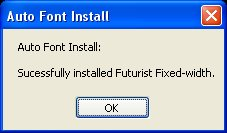

Auto Font Install (v 1.1)
===

Automatically installs one or more fonts so the player doesn't have to. It only does this the first time the game is run and the process is quite transparent (notification to the player is optional).

The first time the player runs the game, the fonts are installed:

(The above notification window is optional.)

The newly-installed font can be put to use immediately:

Features
---

* handles installation of fonts so players don't have to
* supports multiple fonts
* transparent installation

Demo
---
See `demo` directory. Requires RMXP, of course.

Installation
---
Copy the script in `src`, and open the Script Editor within RMXP. At the bottom of the list of classes on the left side of the new window, you'll see one called "Main". Right click on it and select "Insert". In the newly created entry in the list, paste this script.

Note that this script uses the [SDK](http://www.hbgames.org/forums/viewtopic.php?t=1802.0), which must be above this script. When it was developed, SDK 1.5 was the latest version.

To avoid this dependency, remove or comment out the 3 SDK-related lines, including the `end` at the bottom.

Usage
---
Create a Fonts folder in the game directory and place all fonts to be installed within. Then update the Filenames and Names constants below, adding an element to both arrays for each font.
  
This script only installs the fonts on the player's computer. You'll still have to refer to them as necessary within the game, e.g. by setting a new default as follows (in main):

    Font.default_name = [Fonts::Names[0], 'MS PGothic']
  
This script also requires the free FileUtils module by Minero Aoki, which is included in the standard Ruby distribution but for some reason not available in RMXP. Download (available in `demo\Data\`) and place it in your scripts subdirectory.
  
Note: if player does not have the rights to install fonts on their machine, this probably won't work -- but then they wouldn't be able to do it manually either. :)
